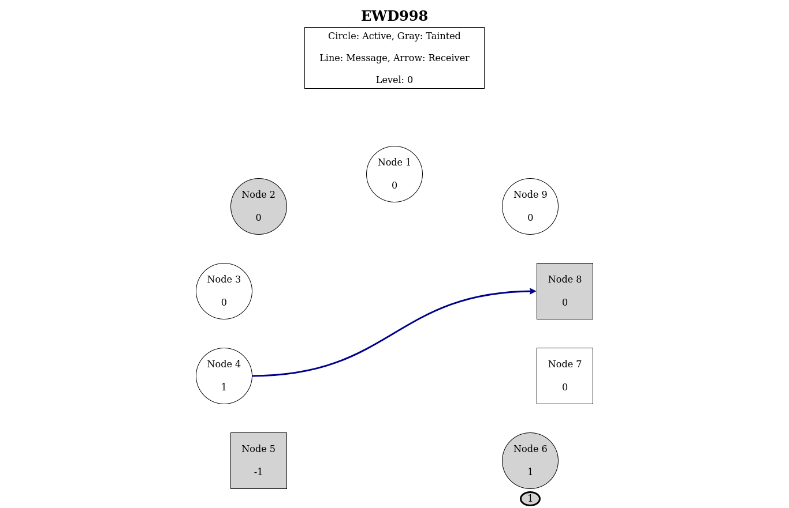

# Example 3

#### Instruction to run

* Get tla2tools.jar from: https://github.com/tlaplus/tlaplus.
* Get CommunityModules-deps.jar from https://github.com/tlaplus/CommunityModules.

To run the specification:
```bash
java -XX:+UseParallelGC -cp path/to/CommunityModules-deps.jar:path/to/tla2tools.jar tlc2.TLC -config EWD998.tla -noGenerateSpecT EWD998
```

To run the template with test data:
```bash
java -XX:+UseParallelGC -cp path/to/CommunityModules-deps.jar:path/to/tla2tools.jar tlc2.TLC -config EWD998_Template.tla -noGenerateSpecTE EWD998_Template
```

To run the template with the specification:
```bash
java -XX:+UseParallelGC -cp path/to/CommunityModules-deps.jar:path/to/tla2tools.jar tlc2.TLC -config EWD998_Anim.tla -simulate -seed 420 -noGenerateSpecTE EWD998_Anim
```

#### Notes
The variable `messages` was added to the EWD998 specification to have the messages currently waiting to be handled.

The Anim module will print a path of states that leads to a state where the invariant is violated. To go forward or backwards in the path you can use the left and right arrow keys (if the file is opened in a browser).

#### Screenshot



#### REF
https://github.com/tlaplus/Examples/tree/master/specifications/ewd998

https://github.com/lemmy/ewd998
