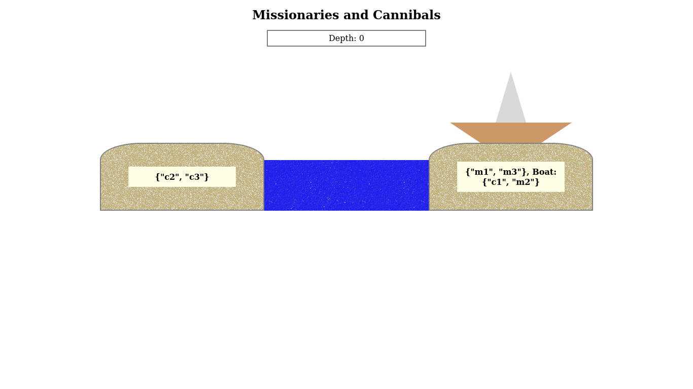

# Example 4

#### Instruction to run

* Get tla2tools.jar from: https://github.com/tlaplus/tlaplus.
* Get CommunityModules-deps.jar from https://github.com/tlaplus/CommunityModules.
* Have the CommunityModules-deps.jar in the same folder of tla2tools.jar.

To run the specification:
```bash
java -XX:+UseParallelGC -cp path/to/tla2tools.jar tlc2.TLC -config MissionariesAndCannibals.tla -noGenerateSpecTE MissionariesAndCannibals
```

To run the template with test data:
```bash
java -XX:+UseParallelGC -cp path/to/tla2tools.jar tlc2.TLC -config MissionariesAndCannibals_Template.tla -noGenerateSpecTE MissionariesAndCannibals_Template
```

To run the template with the specification:
```bash
java -XX:+UseParallelGC -cp path/to/tla2tools.jar tlc2.TLC -config MissionariesAndCannibals_Anim.tla -noGenerateSpecTE MissionariesAndCannibals_Anim
```

#### Notes

The variable `who_moved` was added to the MissionariesAndCannibals specification to have the people that changed island in the current step/state.

The Anim module will print a path of states that leads to a state where the invariant is violated. To go forward or backwards in the path you can use the left and right arrow keys (if the file is opened in a browser).

#### Screenshot



#### REF
https://github.com/tlaplus/Examples/tree/master/specifications/MissionariesAndCannibals
